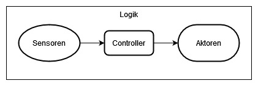

# Allgemeine Beschreibung des Systems

  

Das System besteht im Fundament aus einem Scheduler. Dieser ließt alle konfigurierten Sensoren aus, ruft die Controller auf und triggert passend die Outputs. Der Scheduler wird im script main.py als Process gestartet. Parallel wird die RestAPI Gestartet, welches es dem Nutzer erlaubt, das System zu steuern über eine Rest-Schnittstelle.
#Konfiguration
Alle Konfigurationen werden im Ordner /Configs als JSON Dateien abgelegt.

Für die Sensoren werden erst Klassen definiert, welche das Auslesen der sensoren übernehmen. Diese können dann in der passenden Config-Json angegeben werde mit dem Pin an den der Sensor angeschlossen ist.

Das Prinzip für Aktoren und Controller ist das Selbe.

Weitere Beschreibungen finden sich in den entsprechenden Ordnern.

# Scheduler

Der Scheduler regelt die finale ausführung der Sensoren, Logik und Aktoren. In der Aktuellen Ausführung werden dabei lediglich die Logiken betrachtet, und die dabei angegebenen Sensoren getriggert.
Die daraus resultierende Daten werden direkt and den jeweiligen Controller übergeben und daraus ein Ausgangs-Signal erzäugt.

# RestAPI

Die RestAPI stellt eine Schnittstelle da, um mit dem System über das lokale Netzwerk interagieren zu können. Aufgerufen werden kann die Schnittstelle über IP-der-Brainbox:5000 Die vorhandenen Funktionen sind folgende:

    /pins
    Auflistung aller Pins des System, mit allen relevanten Informationen

    /sensors
    Auflistung aller Sensoren

    /actuators
    Auflistung aller Aktoren

    /logics
    Auflistung aller Logiken(Kombination aus Sensoren, Controller und Aktoren

    /data/<collection>/<length>"
    Wiedergabe der <length> Letzten Werte von <collection>

    /collections
    Auflistung aller verfügbaren Collections

    /stopScheduler
    Stoppt den Scheduler

    /startScheduler
    Startet den Scheduler       

# /Sensoren
Beinhaltet alle Klassen um Sensoren zu definieren.

# /Actuators
Im Ordner Actuators befinden sich alle Klassen, die benutzt werden um Aktoren zu definieren.

# /Controllers
Beinhaltet alle Klassen, mit denen Controller definiert werden können.

# /Logics
Beinhaltet die Klasse um Logiken zu definieren. Logiken sind das überliegende Konstrukt, in dem  die Sensoren,Aktoren und Controller verbunden werden.

# Handler
Handler beinhalten grundlegende Funktionen, welche von allen Instanzen des Systems benötigt werden. Die stellen die Schnittstelle da, die benutzt werden soll um Grundsysteme, wie Datenbanken und Funk zu verwenden. **Eine Nutzung dieser Grundysteme ohne Handler ist nicht vorgesehen.**

## DatabaseHandlers

Beinahltet aktuell nur den MongoDB Handler, kann in Zukunft aber auch um die Nutzung von anderen Datenbank-Typen erweitert werden.

### MongoHandler

Der MongoHandler wird verwendet um mit der MongoDB zu kommunizieren. Diese Datenbank verwaltet alle Daten, die über die Laufzeit entsteht.

## JsonHandlers

Der JsonHandler übernimmt die Verwaltungen aller Json Dateien die das System übernimmt. Json Dateien stellen ein gut lesbares Datenformat dar, welches in normalen .json dateien gespeichert wird. Aktuell wird es benutzt, um die Sensoren, Aktoren und Controller zu konfigurieren. Auf diesem Weg kann der Nutzer bei Bedarf ohne extra Interface die Einstellungen ändern, in dem im Ordner /Configs die passende Json Datei geändert wird.

# Allgemeine Conventionen

## XXX_Test

diese Skripte beschreiben Tests für das Skript XXX und können im allgemeinen ignoriert werden.